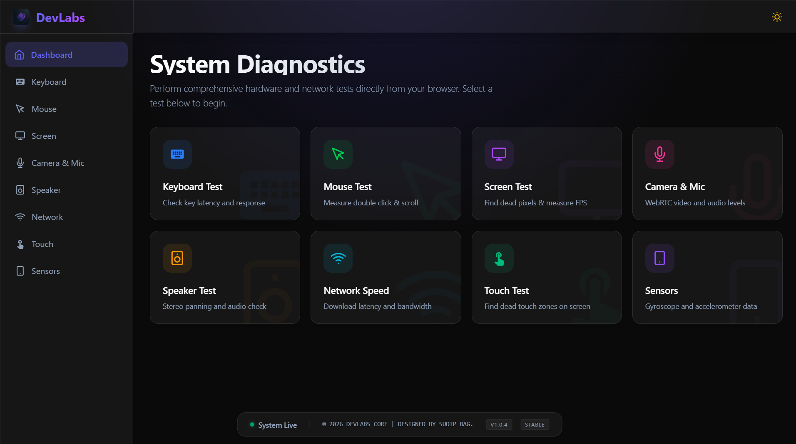

# DevLabs 🖥️ Hardware Diagnostics Lab

[](https://react.dev)
[](https://vite.dev)
[](https://tailwindcss.com)


**DevLabs** is a modern, browser-native hardware testing suite built with React 19 and Tailwind CSS 4. Perform comprehensive diagnostics on input devices, displays, media hardware, audio output, network, touchscreens, and motion sensors using Web APIs and real-time visualizations.

## 📱 Live Demo
[](https://devlabs-project.vercel.app) *Live: https://devlabs-project.vercel.app (deploy your own!)*

## 🌟 Key Features
- **8 Specialized Tests**: From keyboard latency to sensor fusion
- **Production-Grade UI**: Dark mode, glassmorphism, Framer Motion animations (staggered cards)
- **Responsive & Performant**: Mobile-first, Vite HMR, Tailwind JIT
- **Real-Time Metrics**: Event tracking, FPS counters, bandwidth graphs
- **Zero Setup**: Pure browser APIs, no plugins/extensions

## 🎯 Test Suite Overview
| Test | Web APIs Used | Metrics Captured |
|------|---------------|------------------|
| **Keyboard** | `KeyboardEvent` | Latency, repeat rate, ghosting |
| **Mouse** | `PointerEvent`, CPS | Double-click speed, scroll delta |
| **Screen** | `Screen API`, Canvas | Dead pixels, FPS, fullscreen |
| **Media** | `MediaDevices` WebRTC | Camera resolution, mic levels |
| **Speaker** | `AudioContext` | Stereo panning, frequency response |
| **Network** | `PerformanceObserver`, WebRTC | Download/upload, RTT latency |
| **Touch** | `TouchEvent` | Multi-touch zones, pressure mapping |
| **Sensors** | `DeviceOrientationEvent` | Gyroscope, accelerometer, magnetometer |

## 🚀 Getting Started
### Prerequisites
- Node.js 20+
- npm/yarn/pnpm

### Installation
```bash
git clone https://github.com/Sudip294/DevLabs.git
cd DevLabs
npm install
```

### Development
```bash
npm run dev      # http://localhost:5173
npm run lint     # ESLint check
npm run build    # dist/ production build
npm run preview  # Preview built app
```

## 🏗️ Architecture
```
src/
├── App.jsx           # React Router v7 (nested routes)
├── components/       # Layout, Sidebar, Navbar (persistent UI)
├── pages/           # 8 test pages + Dashboard grid
├── assets/          # Icons, hero images
└── styles/          # Tailwind + custom glass effects
```
- **Routing**: `/keyboard`, `/mouse`, etc. (Layout wrapper)
- **Styling**: Tailwind 4 (dark: class), custom `glass-card` hovers
- **Animations**: Framer Motion (0.07s stagger)

## 🤝 Contributing
1. Fork & clone
2. Create feature branch (`git checkout -b feature/test-enhance`)
3. Commit (`git commit -m 'feat: add mouse CPS counter'`)
4. Push & PR to `main`

Issues/PRs welcome!

## 🙋 Author
**Sudip294** - [GitHub](https://github.com/Sudip294) | [sudiphero294@gmail.com](mailto:sudiphero294@gmail.com)

---

*Built with passion for hardware diagnostics 🔧*
